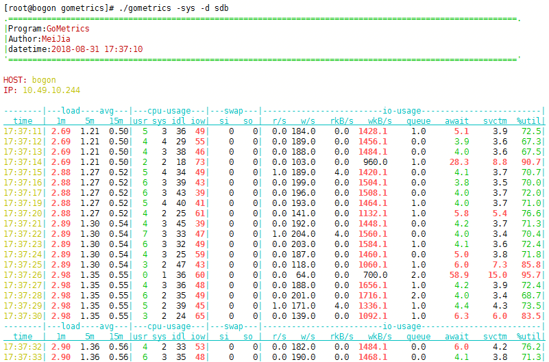
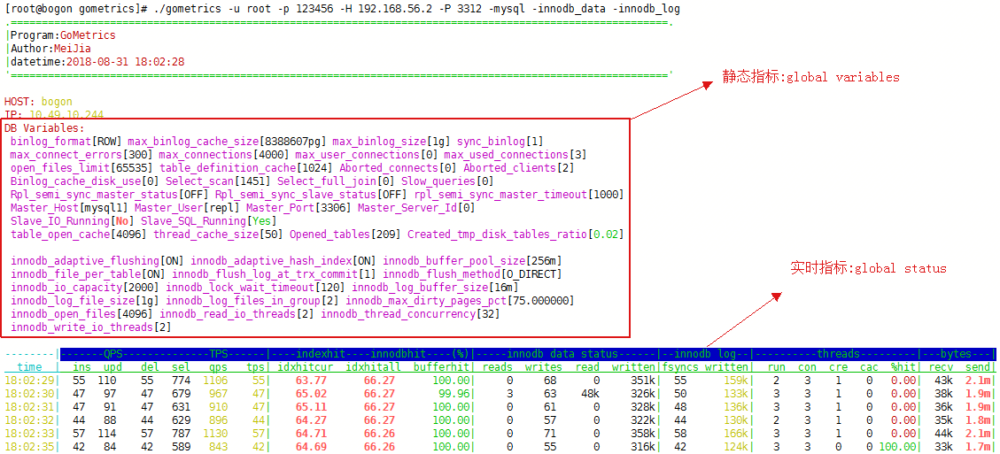
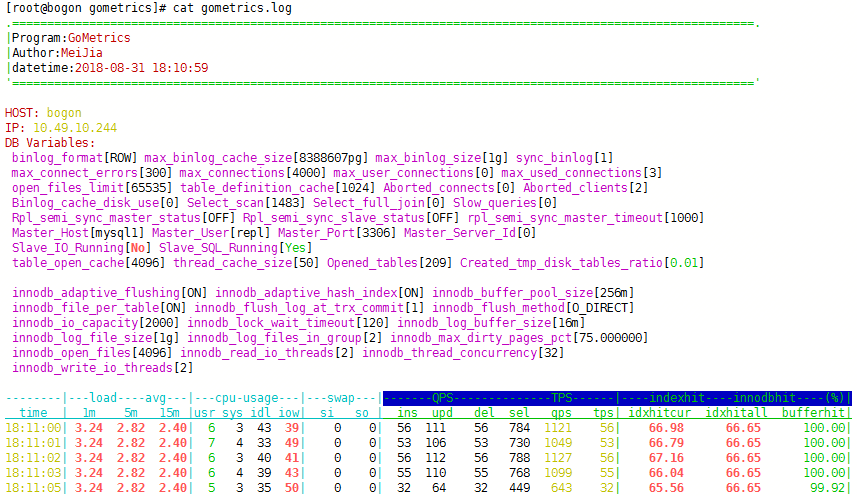
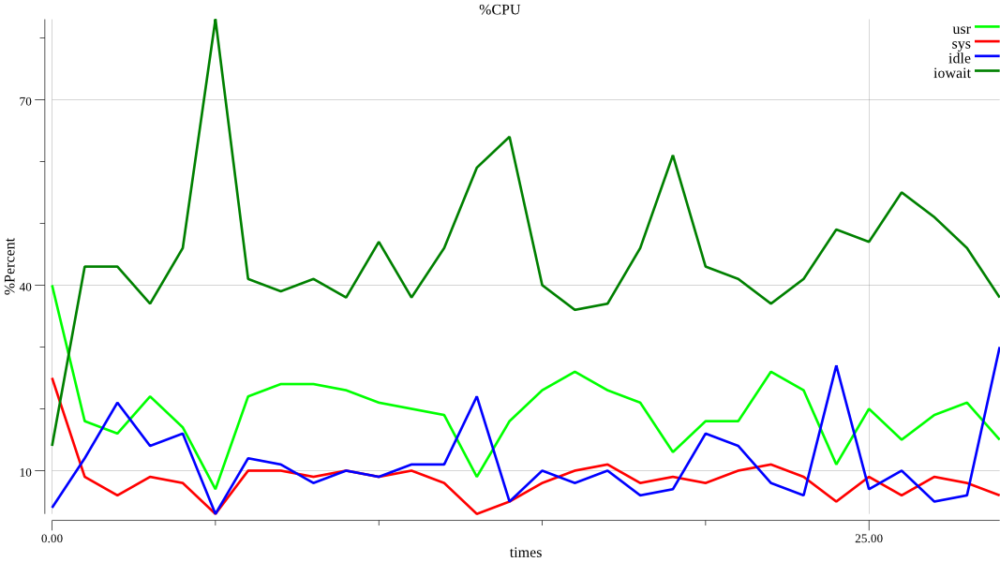
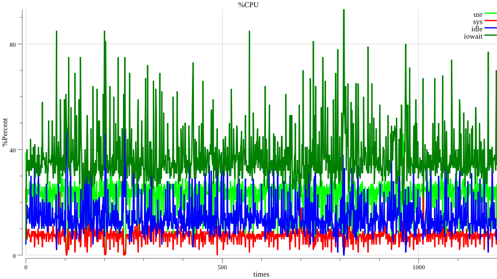
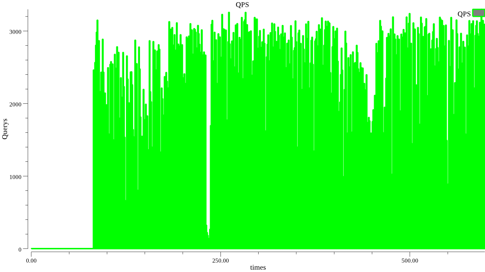
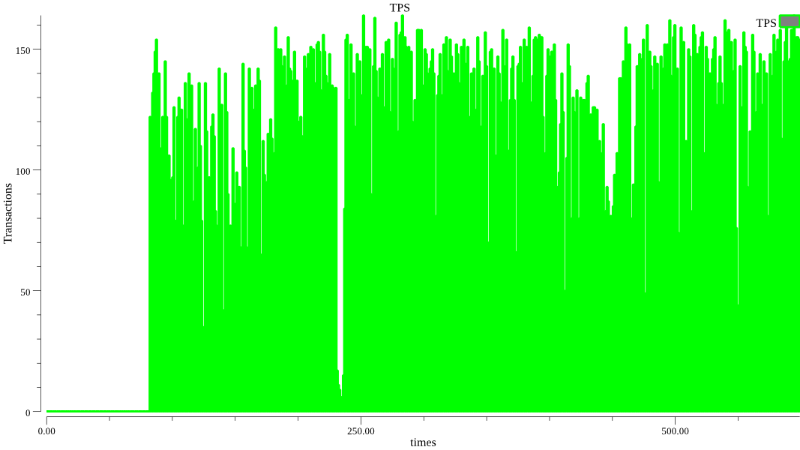

**gometrics功能测试：**

字体颜色：

    红字：警告
    绿字：健康
    黑字：一般
    黄字：一般为经过计算加工过的结果

**一.测试收集OS指标:**

    gometrics -sys -d [device_name]

**二.测试收集MySQL指标**

    ./gometrics -u root -p xxx -H ip -P port -mysql -innodb_data -innodb_log

**三.保存收集日志**

    收集5S的日志存放于当前路径下gometrics.log中:
    ./gometrics -u root -p 123456 -H 192.168.56.2 -P 3312 -lazy -C 5 -L ./gometrics.log

**四.生成折线，直方图**

目前可以生成cpu,qps,tps指标的折线图。

	生成CPU折线图
	./gometrics -c -C 30

	当测试时间较长时，多条折线在一张图中展示不是很美观
	./gometrics -c -C 1200

	生成QPS,TPS直方图
	./gometrics -u root -p 123456 -H 192.168.56.2 -P 3312 -com -C 600

